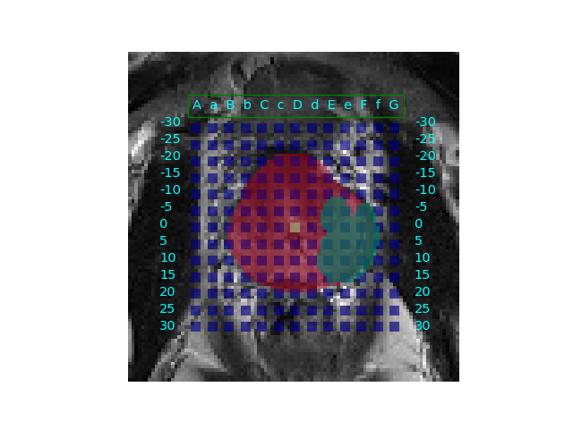
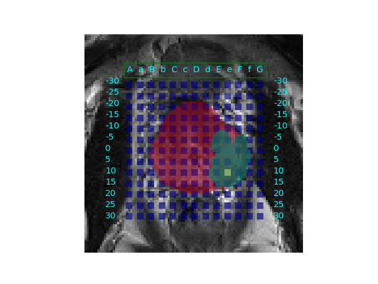

# BiopsyGame
An interactive user game that simulates a prostate biopsy procedure 

## Game screen 

  
  

Examples of the game screen can be visualised here. Grid points are shown in blue, whilst lesions and prostate gland masks are displayed in green and red respectively. Previously visited grid positions can also be seen, for up to two timesteps behind, and displayed as yellow box points. 

## Game instructions
Users are shown images of the MR volume, prostate and lesion masks, along with a brachytherapy grid. 

To select a grid position, simply click on a desired grid point, then close the image. A new image will pop up with an updated screen : a yellow dot signifies the previously visited grid positions. 
The user repeats the same process until all 5 biopsy needles have been fired.

## Comparison with RL predictions 

The user can also choose to fire grid positions suggested by trained RL agents.
TODO: Display RL suggestions in "info bar" on game screen
