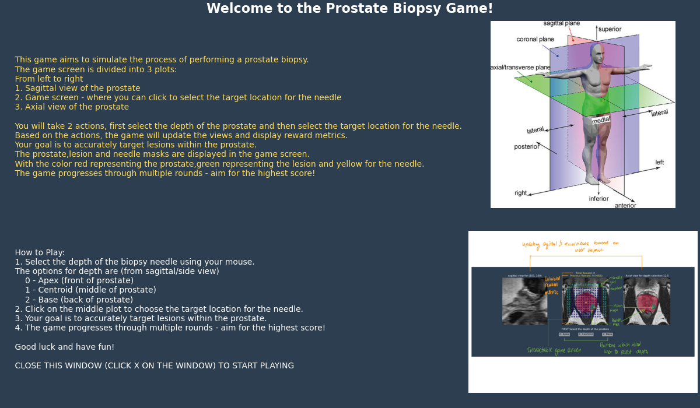
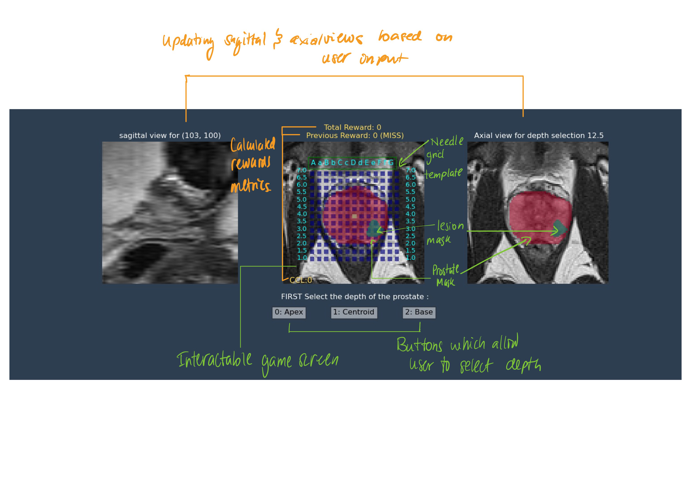
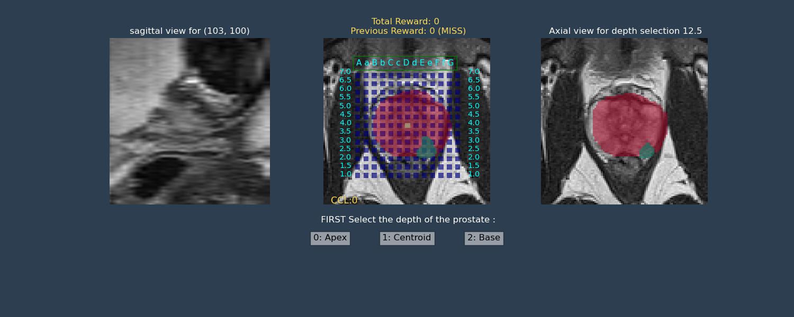
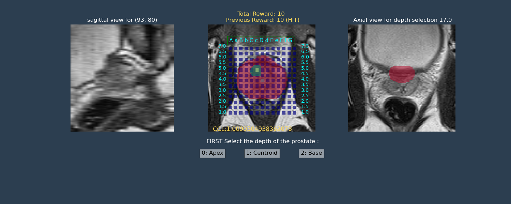

# BiopsyGame
An interactive user game that simulates a prostate biopsy procedure 

## Game screen 

When the program is run instructions will appear. Read through them to learn how to play the game and close it to continue.



Examples of the game screen can be visualised here.

There are 3 views shown within the game from left to right is the axial view, the interactable game screen.

Grid points are shown in blue, whilst lesions and prostate gland masks are displayed in green and red respectively. Previously visited grid positions can also be seen, for up to two timesteps behind, and displayed as yellow box points. Additionally the total rewards for the given episode, previous reward and core cancer length can be seen 

## Game instructions


Users are shown images of the MR volume, prostate and lesion masks, along with a brachytherapy grid. 

To select a grid position, simply click on a desired grid point, then close the image. A new image will pop up with an updated screen : a yellow dot signifies the previously visited grid positions. 
The user repeats the same process until all 5 biopsy needles have been fired.


# Download instructions  

# Setting up 

## Clone repo to workspace 
Clone this repository 

## Setup conda environment 

Download Anaconda or miniconda using the following following links 

Anaconda: https://docs.anaconda.com/free/anaconda/install/#installation

Miniconda :https://docs.anaconda.com/free/miniconda/

Once anaconda/miniconda is installed, create a conda environment with the necessary packages in requirements.txt

replacing <env> with a suitable name for the environment e.g biopsyenv
```bash
conda create --name <env> --file requirements.txt
```
## Activating environment 
To activate the environment enter the following line into terminal 

```bash
activate <env>
```

## Adding the mri data 

Copy paste the given MRI files (nifti/.nii) within the data folder inside the cloned Biopsy Game repo

```bash 
C:\Path-to-biopsy-folder\BiopsyGame\Data
```
# Running application 

To run the game enter the following line into terminal 

```bash
python play_game.py
```

A screen with instructions on how to play the game will appear.
# Once you are finished playing the game 

After you are done playing the game please answer the following questionnaire 

https://forms.gle/djSBxRjfsRDb2oi88
